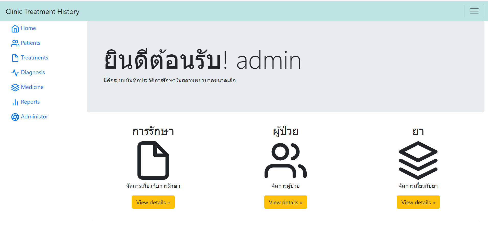
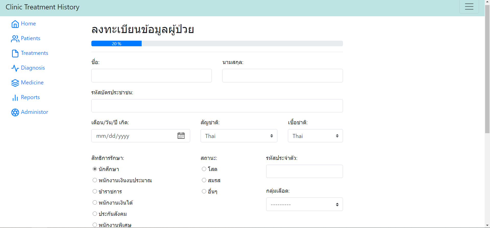
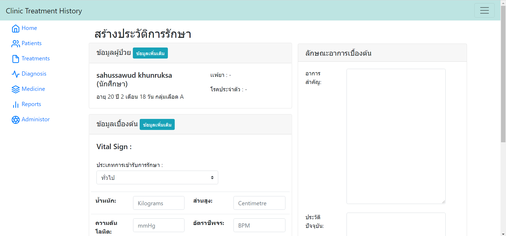
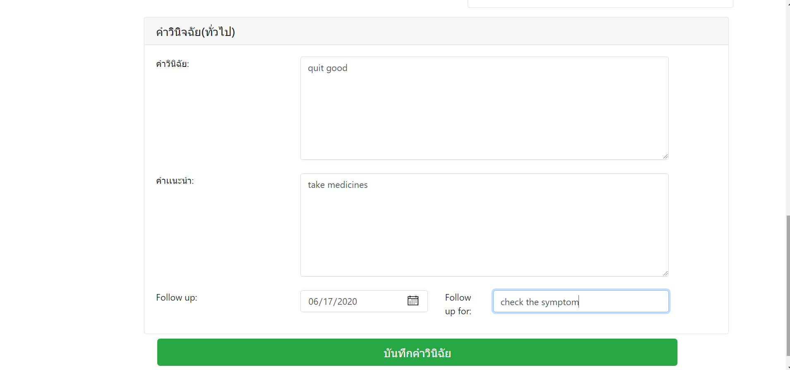
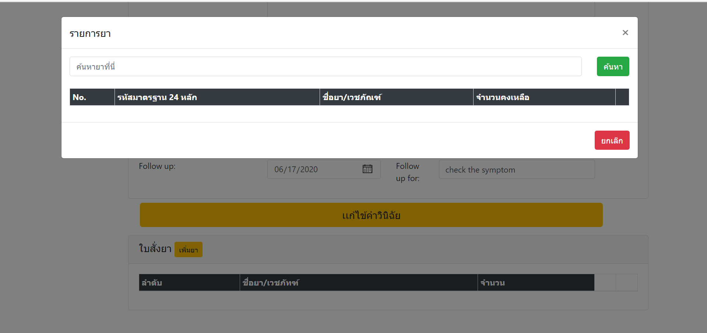
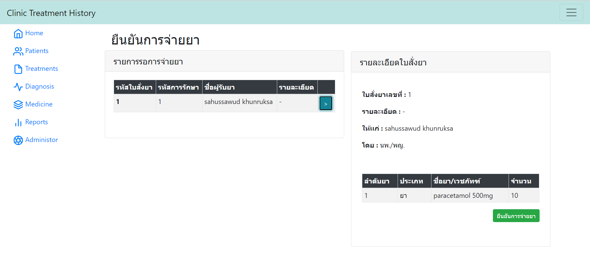

# Clinic Management Application
ระบบบันทึกประวัติการรักษาในสถานพยาบาลขนาดเล็ก
Web Programming 2020 - ITKMITL 


<h1>ที่มาและปัญหา</h1>
เนื่องจากการเข้ารับการรักษาในสถานพยาบาลขนาดเล็ก นั้นไม่มีระบบฐานข้อมูลเก็บประวัติการเข้ารักษาที่ดี ยังคงบันทึกข้อมูลลงบนกระดาษอยู่ ทำให้ใช้เวลานานในการค้นหาข้อมูลผู้ป่วย และส่งต่อให้แพทย์ผู้ดูแลคนไข้เพื่อเข้ารับการรักษา

<h1>วัตถุประสงค์</h1>
<li>เพื่อพัฒนาระบบบันทึกประวัติการรักษาที่สามารถนำไปใช้ใน งานด้านการบริหารสถานพยาบาลขนาดเล็ก</li>
<li>เพื่อความรวดเร็วในการค้นหาข้อมูลของผู้เข้ารับการรักษา เพิ่มจำนวนการรองรับผู้ป่วยในการเข้ารับการรักษาได้มากขึ้น</li>
<li>เพื่อลดการซ้ำซ้อนของข้อมูล ที่บางกระบวนการในการเข้ารับการรักษานั้นมีการเก็บข้อมูลในบางส่วนที่เหมือนกันแต่อับเดตไม่พร้อมกัน</li>
<li>เพื่อลดการทำงานของฝ่ายเวชทะเบียนที่จำเป็นต้องเก็บรักษาข้อมูลที่เป็นข้อมูลรูปแบบเดิมที่ต้องใช้เนื้อที่ในการเก็บและมีความยากลำบากในการรักษา</li>
<li>เพื่อให้แพทย์ที่ดูแลคนไข้ ได้รับข้อมูลเกี่ยวกับประวัติการรักษาเพื่อประกอบการวินิจฉัยการป่วยได้ดีขึ้น</li>
<li>เพื่อมีข้อมูลใช้ในการบริหารคลังยาอย่างมีประสิทธิภาพ และ ตรวจสอบได้</li>
<li>เพื่อนำข้อมูลประวัติการรักษาจัดทำหน้าสรุปผลประวัติการรักษาได้</li>

<h1>ขอบเขตของการพัฒนาระบบ</h1>
 ระบบจากสามารถลงทะเบียนผู้ป่วยที่เข้ารับการรักษาใหม่ มีการเก็บประวัติการรักษาของผู้ป่วยในแต่ละครั้ง สามารถแสดงผลประวัติการเข้ารับการรักษาสำหรับการวินิจฉัย เก็บข้อมูลของแพทย์ผู้เข้าให้การรักษา บันทึกข้อมูลการให้ยา และ การจัดการคลังยาของสถานพยาบาล

<hr>
<h1>installations</h1>

```
python -m venv env
```

Select Interpreter ``ctrl + shift + P``

```
'env':venv
```

OR

```
/env/Scripts/Activate.ps1
```

Install Requirements files
```
pip install -r requirements.txt
```
Create or Update Database
```
python manage.py makemigrations
python manage.py migrate
```

Runserver !
```
python .\manage.py runserver
```

<h1>Preview</h1>
<br>







